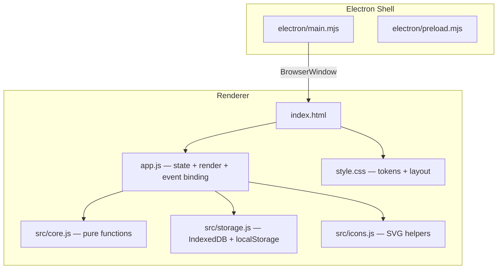
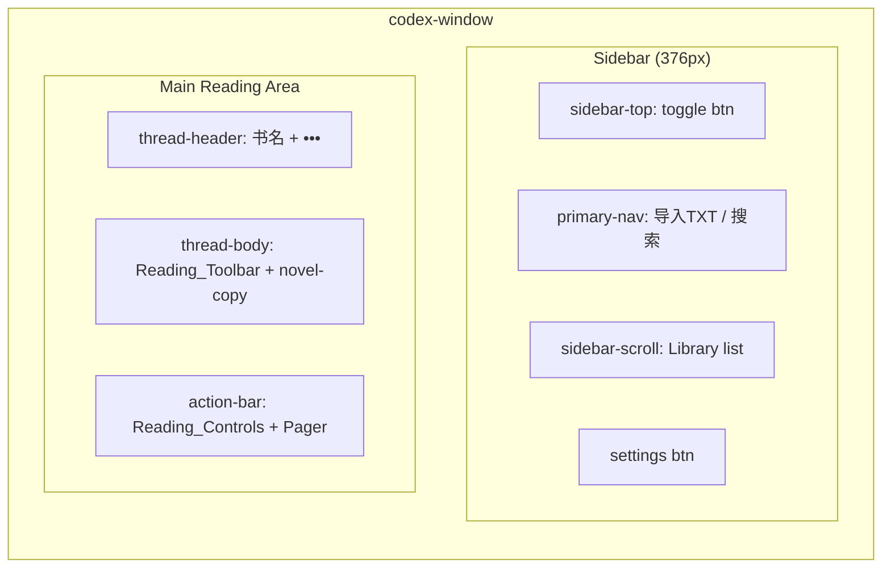
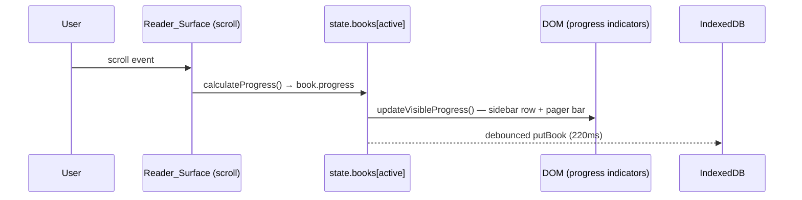
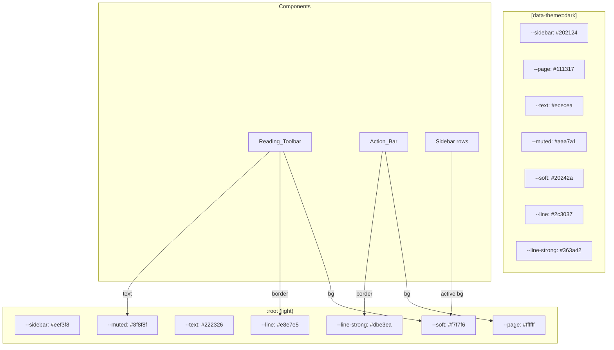

# Design Document — ui-polish-pass

## Overview

本设计覆盖 moyuNovel 阅读器的一次界面打磨（polish pass）。核心目标是移除所有装饰性死控件、统一进度展示、修复键盘焦点冲突、让 Reading_Toolbar 默认可见且主题感知，并将真实阅读控件从假 composer 中分离到专用 Action_Bar。

设计原则：
- **减法优先**：删除比修复优先级更高。
- **单一职责**：每个 DOM 节点要么承载阅读功能，要么不存在。
- **主题一致**：所有颜色通过 CSS custom properties 派发，dark mode 不出现硬编码浅色。
- **向后兼容**：localStorage 中的旧 key 被忽略而非报错。

技术栈不变：vanilla JS（ES modules）、CSS、Electron shell。不引入框架或构建工具。

---

## Architecture

### High-Level Component Diagram



### New Layout Structure (post-polish)



### Data Flow: Progress Updates



### CSS Token Usage for Theming



---

## Components and Interfaces

### 1. DOM Removals

| Element | CSS class / selector | Action |
|---------|---------------------|--------|
| Top_Bar "运行" button | `.thread-actions button[aria-label="运行"]` | Remove from render |
| Top_Bar "模型" button | `.model-button` | Remove from render |
| Top_Bar "终端" button | `.thread-actions button[aria-label="终端"]` | Remove from render |
| Top_Bar "信息" button | `.thread-actions button[aria-label="信息"]` | Remove from render |
| Top_Bar "面板" button | `.thread-actions button[aria-label="面板"]` | Remove from render |
| Primary_Nav "插件" | 3rd `<button>` in `.primary-nav` | Remove from render |
| Primary_Nav "自动化" | 4th `<button>` in `.primary-nav` | Remove from render |
| Composer textarea | `#composer-input` / `.composer-input` | Remove from render |
| Composer model label | `.model-label` | Remove from render |
| Composer send button | `.send-button` | Remove from render |
| Composer "打开文件夹" access-button | `.access-button` | Move to Action_Bar as icon button |
| Project_Groups section | `.project-section`, "新建项目" row | Remove from render |
| Fake status line | `.tool-line` "已处理 1s" | Replace with real status or remove |

### 2. New Action_Bar (replaces `.composer`)

The bottom area becomes a slim toolbar instead of a chat composer:

```html
<footer class="action-bar-area">
  <div class="action-bar">
    <button class="action-btn" data-action="import-file" aria-label="导入 TXT">
      <!-- iconPlus -->
    </button>
    <button class="action-btn" data-action="import-folder" aria-label="打开文件夹">
      <!-- iconFolder -->
    </button>
    <input id="file-input" type="file" accept=".txt,text/plain" hidden />
    <input id="folder-input" type="file" ... hidden />
    <div class="spacer"></div>
    <button class="action-btn" data-action="toggle-auto-scroll">
      <!-- 自动 / 停 -->
    </button>
    <button class="action-btn" data-action="toggle-prefs" aria-label="阅读偏好">
      <!-- iconSettings -->
    </button>
  </div>
  <!-- Preferences_Panel (conditional) -->
  <div class="pager">...</div>
</footer>
```

**Design decisions:**
- A-/A+ buttons removed — font size is controlled exclusively via Preferences_Panel slider (Req 3.2).
- Single prefs entry point: the gear icon in Action_Bar (Req 3.3).
- No textarea, no send button, no model label.
- Import buttons remain as the primary way to add books.

### 3. Reading_Toolbar Changes

```css
.reader-command-bar {
  /* BEFORE: opacity: 0.42; transition: opacity 140ms; */
  /* AFTER: */
  opacity: 1;
  /* Remove hover/focus-within opacity override */
}

.reader-command-bar,
.chapter-jump,
.reader-search {
  background: var(--soft);
  border-color: var(--line);
  color: var(--muted);
}

.reader-search input,
.chapter-jump select {
  color: var(--text);
}
```

Dark mode overrides use the same tokens — no hardcoded `rgba(24, 27, 33, 0.88)`.

### 4. Keyboard Handler Refactor

Current `handleKeydown` unconditionally captures Space/Arrow/Page keys. New logic:

```javascript
function handleKeydown(event) {
  // Guard: if focus is in an editable field, do nothing
  if (isEditableTarget(event.target)) return;

  const reader = app?.querySelector('[data-reader-scroll]');
  if (!reader) return;
  // ... existing scroll logic
}

function isEditableTarget(el) {
  if (!el) return false;
  const tag = el.tagName;
  if (tag === 'INPUT' || tag === 'TEXTAREA' || tag === 'SELECT') return true;
  if (el.isContentEditable) return true;
  return false;
}
```

### 5. Chapter Select Reset Logic

After `jumpToLine` is called from the chapter select handler:

```javascript
app.querySelector('#chapter-select')?.addEventListener('change', (event) => {
  const index = Number(event.target.value);
  if (!isNaN(index)) jumpToLine(index);
  // Reset to placeholder so same chapter is re-selectable
  event.target.value = '';
});
```

### 6. Sidebar Book Row: Inline Rename + Delete Button

Each book row gains a visible delete button (small × icon) on hover/focus:

```html
<div class="thread-row active" role="button" tabindex="0" data-book-id="...">
  <span contenteditable="true" spellcheck="false" data-edit-book-id="...">书名</span>
  <time>42%</time>
  <button class="row-delete-btn" data-action="delete-book" data-delete-id="..." aria-label="删除">×</button>
</div>
```

CSS: `.row-delete-btn` is `opacity: 0` by default, `opacity: 1` on `.thread-row:hover .row-delete-btn` or `.thread-row:focus-within .row-delete-btn`.

Inline rename is already implemented via `contenteditable` + `handleBookInlineEdit`. The existing `renameActiveBook()` prompt-based branch is removed from `handleAction` since inline editing covers it (Req 8.5).

### 7. Clear-Library Flow

Current behavior: clear → reseed demo → render (user sees demo book, thinks clear failed).

New behavior:

```javascript
async function clearLibrary() {
  if (!window.confirm?.('清空所有已导入小说和阅读进度？')) return;
  await clearBooks(state.db, () => { state.books = []; });
  // Do NOT reseed demo book immediately
  state.books = [];
  state.activeBookId = null;
  state.restoreScrollTop = 0;
  state.status = '书架已清空';
  saveUi();
  render();
}
```

When `state.books` is empty and `state.activeBookId` is null, `render()` shows an empty state:

```html
<section class="message-stack empty-state">
  <p>书架是空的</p>
  <button data-action="import-file">导入 TXT 开始阅读</button>
  <button data-action="load-demo">加载演示文本</button>
</section>
```

The "加载演示文本" button explicitly reseeds the demo book — user-initiated, not silent.

### 8. Font Stack CSS Updates

```css
/* songti — Chinese serif preferred */
.novel-copy {
  font-family: "Songti SC", "STSong", "SimSun", "Noto Serif CJK SC",
               "Source Han Serif SC", serif;
}

/* serif — Latin serif preferred, CJK fallback */
.font-serif .novel-copy {
  font-family: Georgia, "Times New Roman", "Noto Serif CJK SC",
               "Songti SC", "SimSun", serif;
}

/* sans — unchanged */
.font-sans .novel-copy {
  font-family: "PingFang SC", "Microsoft YaHei", "Noto Sans CJK SC", sans-serif;
}
```

Key change: `songti` stack adds `SimSun` (Windows 宋体) before generic `serif`. `serif` stack puts `Georgia` first so Windows users see a visible difference.

### 9. Visual Polish

**Chapter headings:**
```css
.novel-copy .chapter-line {
  margin-top: 2em;
  margin-bottom: 0.6em;
  padding-bottom: 0.3em;
  border-bottom: 1px solid var(--line);
  color: var(--text);
  font-size: 1.1em;
  font-weight: 700;
  letter-spacing: 0.02em;
}
```

**Search highlight simplification:**
Remove `.search-line` background gradient. Only `<mark>` elements provide highlight:
```css
/* REMOVE: .novel-copy .search-line { background: linear-gradient(...) } */
.novel-copy mark {
  border-radius: 3px;
  background: rgba(255, 214, 92, 0.55);
  color: inherit;
  padding: 1px 2px;
}
```

In dark mode:
```css
.codex-window[data-theme="dark"] .novel-copy mark {
  background: rgba(255, 180, 50, 0.3);
}
```

**Scrollbar tuning:**
```css
*::-webkit-scrollbar { width: 6px; height: 6px; }
*::-webkit-scrollbar-thumb {
  border: 1.5px solid transparent;
  border-radius: 999px;
  background: rgba(0, 0, 0, 0.12);
  background-clip: content-box;
}
*::-webkit-scrollbar-thumb:hover {
  background: rgba(0, 0, 0, 0.25);
  background-clip: content-box;
}
```

### 10. Mobile Breakpoint Cleanup

At `≤620px`:
- Remove all `.composer`-related mobile rules (`.composer`, `.composer-input`, `.composer-bottom`, `.spacer`, `.access-button`, `.model-label`).
- `.action-bar` gets `flex-wrap: wrap; gap: 8px; padding: 8px 12px;`.
- `.reader-command-bar` keeps `opacity: 1` (already set globally, no mobile override needed).
- Bottom padding on `.thread-body` adjusted to account for slimmer Action_Bar (was 240px for composer, now ~140px).

### 11. State/Storage Migration

**Removed from `state`:**
- `composerText` — no longer used (no textarea).
- `projectGroups` — no longer rendered.

**Storage tolerance:**
```javascript
// In init():
// These reads are wrapped to tolerate missing/malformed keys
const ui = readJson(UI_KEY) || {};
// PROJECTS_KEY and COMPOSER_KEY are simply not read anymore.
// If they exist in localStorage, they are ignored (not deleted).
```

`readJson` already returns `null` on parse failure, so no code change needed there. The `PROJECTS_KEY` and `COMPOSER_KEY` imports can be removed from `app.js`. The constants remain in `storage.js` for backward compatibility but are unused.

**`saveUi` no longer writes `composerText` or `projectGroups`** — it already doesn't (it only writes UI prefs). No migration needed.

---

## Data Models

No schema changes to IndexedDB (`DB_NAME`, `DB_VERSION`, `BOOK_STORE` unchanged).

The `state` object shape changes:

```javascript
// BEFORE
const state = {
  books: [],
  activeBookId: null,
  fontSize: 21,
  lineHeight: 1.9,
  readerWidth: 850,
  fontFamily: 'songti',
  theme: 'light',
  autoScroll: false,
  autoScrollSpeed: 3,
  prefsOpen: false,
  db: null,
  status: '',
  error: '',
  restoreScrollTop: null,
  saveTimer: null,
  autoScrollTimer: null,
  searchQuery: '',
  searchIndex: 0,
  composerText: '',      // ← REMOVED
  projectGroups: [],     // ← REMOVED
};

// AFTER
const state = {
  books: [],
  activeBookId: null,
  fontSize: 21,
  lineHeight: 1.9,
  readerWidth: 850,
  fontFamily: 'songti',
  theme: 'light',
  autoScroll: false,
  autoScrollSpeed: 3,
  prefsOpen: false,
  db: null,
  status: '',
  error: '',
  restoreScrollTop: null,
  saveTimer: null,
  autoScrollTimer: null,
  searchQuery: '',
  searchIndex: 0,
};
```

---

## Correctness Properties

*A property is a characteristic or behavior that should hold true across all valid executions of a system — essentially, a formal statement about what the system should do. Properties serve as the bridge between human-readable specifications and machine-verifiable correctness guarantees.*

### Property 1: Keyboard focus guard

*For any* keydown event where the event target is an Editable_Field (input, textarea, select, or contenteditable element), the `handleKeydown` function SHALL NOT call `preventDefault` or trigger Reader_Surface scrolling.

**Validates: Requirements 6.1, 6.3, 6.4**

### Property 2: Keyboard scroll when unfocused

*For any* keydown event with key ∈ {Space, ArrowRight, PageDown, ArrowLeft, PageUp} where the event target is NOT an Editable_Field, the `handleKeydown` function SHALL trigger a scroll operation on the Reader_Surface.

**Validates: Requirements 6.2, 13.2**

### Property 3: Progress indicator invariant

*For any* scrollTop, scrollHeight, and clientHeight triple (where scrollHeight ≥ clientHeight ≥ 0 and 0 ≤ scrollTop ≤ scrollHeight − clientHeight), all visible Progress_Indicators referencing the active Book SHALL display the same value equal to `calculateProgress({scrollTop, scrollHeight, clientHeight})`.

**Validates: Requirements 4.3, 4.4**

### Property 4: Chapter dropdown reset after selection

*For any* valid chapter index selected from the chapter dropdown, after the Reader scrolls to that chapter heading, the dropdown's `.value` SHALL equal the empty string (placeholder), making the same chapter immediately re-selectable.

**Validates: Requirements 7.2, 7.3**

### Property 5: Preferences toggle idempotence

*For any* initial value of `state.prefsOpen`, invoking the toggle-prefs action twice in succession SHALL return `state.prefsOpen` to its original value.

**Validates: Requirements 3.5**

### Property 6: localStorage tolerance on init

*For any* combination of the keys `UI_KEY`, `PROJECTS_KEY`, and `COMPOSER_KEY` being absent from localStorage, or containing malformed (non-JSON) data, the `init()` function SHALL complete without throwing and SHALL produce a valid render.

**Validates: Requirements 2.2, 13.4**

### Property 7: Zero chapters hides dropdown

*For any* Book whose text produces zero results from `extractChapters(splitTextBlocks(book.text))`, the rendered DOM SHALL NOT contain the `#chapter-select` element.

**Validates: Requirements 5.4**

### Property 8: Single highlight treatment per search match

*For any* text line and search query where `findMatches` reports one or more matches on that line, the rendered HTML for that line SHALL contain `<mark>` elements for each match but SHALL NOT additionally apply a `.search-line` background class to the containing `<p>`.

**Validates: Requirements 11.3**

### Property 9: formatProgress consistency

*For any* integer progress value in [0, 100], the `formatProgress` function SHALL return the same string regardless of where it is called (sidebar row, pager, message-title-row), ensuring a single canonical format across the UI.

**Validates: Requirements 4.2**

---

## Error Handling

| Scenario | Handling |
|----------|----------|
| IndexedDB unavailable | Fallback to in-memory `state.books`; show `state.error` message. No change from current behavior. |
| `readJson` parse failure | Returns `null`; caller uses default. Already implemented. |
| Legacy `PROJECTS_KEY` / `COMPOSER_KEY` in localStorage | Ignored on read (keys not accessed). Not deleted — avoids unnecessary writes. |
| File import with 0 valid TXT files | `state.status = '没有发现 TXT 文件。'`; no state change. |
| Empty book text after import | Skip silently, show status. |
| `clearLibrary` with no books | Confirm dialog still shown; after confirm, show empty state. |
| Chapter select on book with no chapters | Dropdown not rendered (Property 7). |

---

## Testing Strategy

### Unit Tests (example-based)

Extend `tests/reader-core.test.mjs` with:
- `isEditableTarget` returns true for input/textarea/select/contenteditable.
- `formatProgress` returns expected strings for 0, 50, 100.
- `extractChapters` returns empty array for text with no chapter headings.
- DOM structure assertions: after render with empty books, no `.project-section`, no `.composer-input`, no `.send-button`.

### Property-Based Tests

**Library:** [fast-check](https://github.com/dubzzz/fast-check) (already compatible with Node ESM, no build step needed).

**Configuration:** Each property test runs a minimum of 100 iterations.

**Tag format:** `Feature: ui-polish-pass, Property {N}: {title}`

| Property | Generator Strategy |
|----------|-------------------|
| 1 — Keyboard focus guard | Generate random keys from {Space, ArrowLeft, ArrowRight, PageUp, PageDown} × random editable element types |
| 2 — Keyboard scroll unfocused | Same key set × non-editable targets |
| 3 — Progress invariant | Generate random (scrollTop, scrollHeight, clientHeight) triples with valid constraints |
| 4 — Chapter dropdown reset | Generate random chapter indices from a generated chapter list |
| 5 — Prefs toggle idempotence | Generate random boolean for initial `state.prefsOpen` |
| 6 — localStorage tolerance | Generate random subsets of keys × random string values (valid JSON, invalid JSON, missing) |
| 7 — Zero chapters hides dropdown | Generate random text strings that do NOT match `isChapterTitle` |
| 8 — Single highlight | Generate random (line, query) pairs where query appears in line |
| 9 — formatProgress consistency | Generate random integers in [0, 100] |

### Integration Tests

- Import a TXT file → verify it appears in IndexedDB and sidebar.
- Clear library → verify IndexedDB empty and empty state rendered.
- Inline rename → verify IndexedDB updated and DOM reflects new title.

### Regression Guard

Existing tests in `tests/reader-core.test.mjs`, `tests/electron-options.test.mjs`, and `tests/window-state.test.mjs` must continue to pass unchanged (Req 13).
